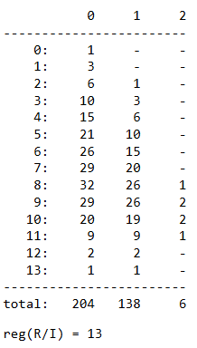

# shortRes
A Sage package for computing the short resolution of a weighted homogeneous ideal.

Examples can be found in the help section of each function (function? will return this section). 

## How to use 
Download shortRes.py and write `load("shortRes.py")` in Sage. Depending on your current directory, this may require specifying the path of the package, e.g., `load("/home/user/shortRes.py")`.  

## Small example
```python
load("shortRes.py")
A = numpy.array([[7,2,3],[1,8,3],[3,8,1],[12,0,0],[0,12,0],[0,0,12]]);
r,I = toricIdeal(A,QQ);
res = shortRes(r,I,1);
```
Output: 

 

## List of functions
We provide 4 main functions, as well as 1 auxiliary function. 
  - **Main functions**: 'toricIdeal', 'shortRes', 'schreyerResDim3', 'pruningDim3'.
  - **Auxiliary function**: 'sortLex'.

## Citation
If you use this implementation, please consider citing the paper [https://doi.org/10.48550/arXiv.2503.17764](https://doi.org/10.48550/arXiv.2504.12019) and/or this repository.

### Citation for the paper
```
@article{GGG2025_shortRes,
      title={{Computational Aspects of the Short Resolution}}, 
      author={Garc\'ia-Marco, Ignacio and Gimenez, Philippe and Gonz\'alez-S\'anchez, Mario},
      year={2025},
      journal = {ArXiv preprint},
      doi = {https://doi.org/10.48550/arXiv.2504.12019}
}
```
### Citation for the repository
```
@misc{github_shortRes,
    title = {{ShortRes: A Sage package to compute the short resolution of a weighted homogeneous ideal}},
    author = {Gonz\'alez-S\'anchez, Mario},
    year = {2025},
    howpublished = {GitHub Repository},
    note = {Available online: \url{https://github.com/mgonzalezsanchez/shortRes}}
}
```
